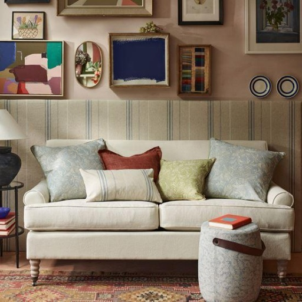
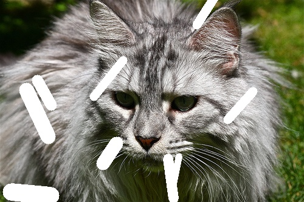

# Image Completeness Detector

This project provides two approaches — 

- **rule-based heuristic method** and 

- **CNN-based deep learning model** 

to detect incomplete images (e.g., corrupted scans or missing data) based on large white or black regions.

---

## Use Case

Detect and flag images as **incomplete** when:
- A significant portion of the image is entirely white (e.g., 255-pixel patches)
- A significant portion of the image is entirely black (e.g., 0-pixel patches)

This is useful in document scanning, medical imaging, or image preprocessing pipelines where data loss needs to be flagged automatically.

---

## Dataset

- Complete images : 1000 images acquired randomly. 
- Incomplete images : 1000 images with significant white or black patches synthetically generated.

Types of Incompleteness Generated

- center_block :

 Large rectangular missing area in the center of the image. 
 Simulates major occlusion or central damage.

- random_patches:

 Multiple smaller rectangular patches randomly scattered.
 Mimics random scratches or pixel dropouts.

- freeform:

 Several irregular curved lines of random length and thickness.
 Looks like scratches, scribbles, or tears.

- irregular_blobs:

 Few irregular elliptical shapes placed randomly.
 Simulates stains, smudges, or ink blots.

---

## Methods

###  Rule-Based Detector (`notebooks/1_rule_based_detector.ipynb`)

- Uses **OpenCV** to read grayscale images
- Flags an image as incomplete if more than a threshold % of its pixels are very white (`>=240`) or very black (`<=15`)
- Fast and interpretable — ideal for well-defined edge cases

**Key Params:**
- `white_thresh = 240`
- `black_thresh = 15`
- `ratio_thresh = 0.3` (30% threshold)

---

### CNN-Based Detector (`notebooks/2_cnn_based_detector.ipynb`)

- Deep learning classifier built with **Keras + CNN**
- Trained on synthetic image data labeled as "complete" or "incomplete"
- Learns to identify complex patterns like partial occlusions, large patches, or artifacts

**Features:**
- Augmented dataset (for robustness)
- 2D ConvNet with ReLU activations and softmax classifier

---

## How to run the notebooks

### Rule-Based Detector

1. Open `notebooks/1_rule_based_detector.ipynb`
2. Change image name in **Analyze a Single Image for Incompleteness** cell
3. Run the remaining cells for complete statistics

### CNN-Based Detector

1. Open `notebooks/2_cnn_based_detector.ipynb`
2. Navigate to **Single Image Inference Example** cell in the notebook
3. Choose test images from "sample_images" folder to classify

---

## Sample Inputs

Located in `sample_images/`:

- `complete_example.jpg`: A regular image
- `incomplete_example.jpg`: Contains large white/black regions

- Complete image : 

- Incomplete image : 

---

